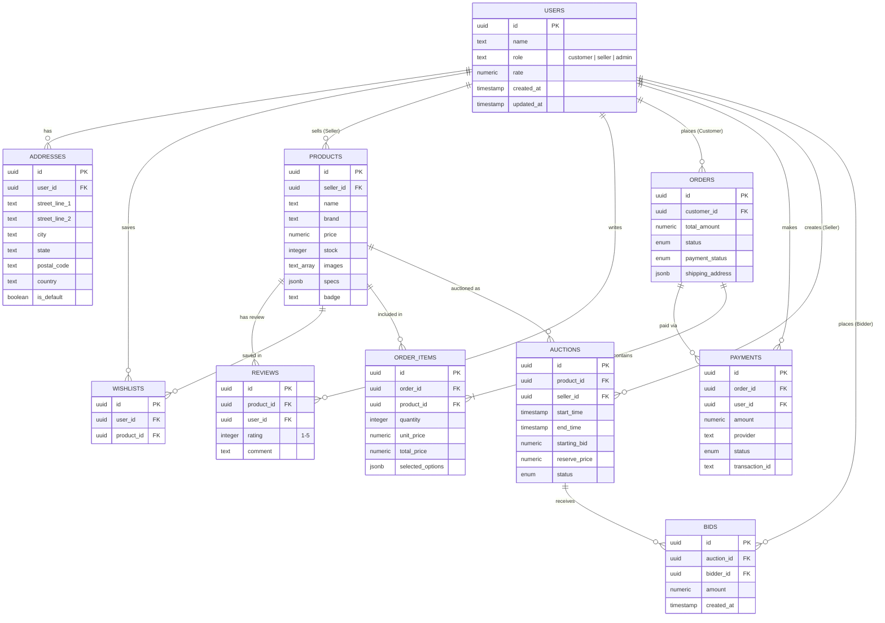

```mermaid
erDiagram
    %% ---------------------------------------------------------
    %% USER MANAGEMENT MODULE
    %% ---------------------------------------------------------
    USERS ||--o{ ADDRESSES : "has"
    USERS ||--o{ WISHLISTS : "saves"

    %% ---------------------------------------------------------
    %% PRODUCT CATALOG MODULE
    %% ---------------------------------------------------------
    USERS ||--o{ PRODUCTS : "sells (Seller)"
    USERS ||--o{ REVIEWS : "writes"
    
    PRODUCTS ||--o{ REVIEWS : "has review"
    PRODUCTS ||--o{ WISHLISTS : "saved in"

    %% ---------------------------------------------------------
    %% COMMERCE & ORDERS MODULE
    %% ---------------------------------------------------------
    USERS ||--o{ ORDERS : "places (Customer)"
    USERS ||--o{ PAYMENTS : "makes"
    
    ORDERS ||--o{ PAYMENTS : "paid via"
    ORDERS ||--|{ ORDER_ITEMS : "contains"
    
    PRODUCTS ||--o{ ORDER_ITEMS : "included in"

    %% ---------------------------------------------------------
    %% AUCTION SYSTEM MODULE
    %% ---------------------------------------------------------
    USERS ||--o{ AUCTIONS : "creates (Seller)"
    USERS ||--o{ BIDS : "places (Bidder)"

    PRODUCTS ||--o{ AUCTIONS : "auctioned as"
    AUCTIONS ||--o{ BIDS : "receives"


    %% =========================================================
    %% ENTITY DEFINITIONS
    %% =========================================================

    USERS {
        uuid id PK
        text name
        text role "customer | seller | admin"
        numeric rate
        timestamp created_at
        timestamp updated_at
    }

    ADDRESSES {
        uuid id PK
        uuid user_id FK
        text street_line_1
        text street_line_2
        text city
        text state
        text postal_code
        text country
        boolean is_default
    }

    PRODUCTS {
        uuid id PK
        uuid seller_id FK
        text name
        text brand
        numeric price
        integer stock
        text_array images
        jsonb specs
        text badge
    }

    WISHLISTS {
        uuid id PK
        uuid user_id FK
        uuid product_id FK
    }

    REVIEWS {
        uuid id PK
        uuid product_id FK
        uuid user_id FK
        integer rating "1-5"
        text comment
    }

    ORDERS {
        uuid id PK
        uuid customer_id FK
        numeric total_amount
        enum status
        enum payment_status
        jsonb shipping_address
    }

    ORDER_ITEMS {
        uuid id PK
        uuid order_id FK
        uuid product_id FK
        integer quantity
        numeric unit_price
        numeric total_price
        jsonb selected_options
    }

    PAYMENTS {
        uuid id PK
        uuid order_id FK
        uuid user_id FK
        numeric amount
        text provider
        enum status
        text transaction_id
    }

    AUCTIONS {
        uuid id PK
        uuid product_id FK
        uuid seller_id FK
        timestamp start_time
        timestamp end_time
        numeric starting_bid
        numeric reserve_price
        enum status
    }

    BIDS {
        uuid id PK
        uuid auction_id FK
        uuid bidder_id FK
        numeric amount
        timestamp created_at
    }
```
