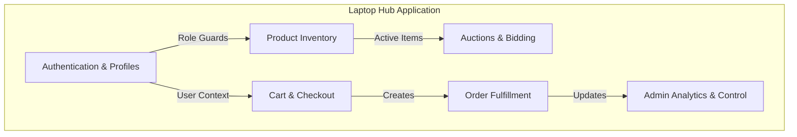

# Laptop Hub - System Architecture & Code Documentation

This document provides a detailed breakdown of the Laptop Hub application's architecture, including its core code segments, system module structure, and reusable components.

---

## 4.4 Major Code Segments

### 1. Authentication Login Handler (`onSubmit` / `AuthService.signIn`)
The `onSubmit` function in the login client component manages the initial authentication flow. It captures the credentials, sends them securely via the Supabase Auth API, handles role-based profiling, and redirects users to their respective dashboards.

```tsx
// Captured from src/components/login-form.tsx
const onSubmit = async (data: LoginFormValues) => {
  setLoading(true);
  try {
    // Authenticate user with Supabase Auth
    await AuthService.signIn(data.email, data.password);
    
    // Retrieve authenticated user data
    const user: any = await AuthService.getUser();

    if (user) {
      // Fetch user profile to determine role (admin, seller, customer)
      const profile: any = await ProfileService.getUserProfile(user.id);

      toast.success("Signed in successfully!");

      // Route-based redirection
      if (profile?.role === "admin") {
        router.push("/admin/dashboard");
      } else if (profile?.role === "seller") {
        router.push("/seller/dashboard");
      } else {
        router.push("/");
      }
      router.refresh();
    }
  } catch (error: any) {
    toast.error(error.message);
    setLoading(false);
  }
};
```

---

### 2. Database Connection Config (`createClient`)
The Supabase SSR initialization configures database client singletons for both client-side and server-side environments. It handles session persistence, token auto-refreshes, and sets up custom routing preferences (such as prioritizing IPv4 resolution).

```ts
// Captured from src/lib/supabase/client.ts
import { createBrowserClient } from '@supabase/ssr'

const supabaseUrl = process.env.NEXT_PUBLIC_SUPABASE_URL!;
const supabaseKey = process.env.NEXT_PUBLIC_SUPABASE_ANON_KEY!;

let browserClient: any;

export function createClient() {
  if (typeof window === 'undefined') {
    return createBrowserClient(supabaseUrl, supabaseKey);
  }

  if (!browserClient) {
    browserClient = createBrowserClient(
      supabaseUrl,
      supabaseKey,
      {
        auth: {
          persistSession: true,
          autoRefreshToken: true,
          detectSessionInUrl: true
        }
      }
    )
  }

  return browserClient
}

export const supabase = createClient();
```

---

### 3. Product Model Table Schema (`public.products`)
This segment represents the primary data structure for products, specifying foreign keys (such as `seller_id`), standard constraints, row-level security (RLS) policies, and updated timestamp triggers.

```sql
-- Captured from supabase/migrations/20251214101141_create_products_table.sql
create table public.products (
  id uuid not null default gen_random_uuid(),
  name text not null,
  description text,
  brand text,
  price numeric(10, 2) not null,
  original_price numeric(10, 2),
  stock integer not null default 0,
  images text[] default array[]::text[],
  specs jsonb default '{}'::jsonb,
  badge text,
  seller_id uuid references auth.users(id) on delete cascade not null,
  created_at timestamp with time zone default now(),
  updated_at timestamp with time zone default now(),
  constraint products_pkey primary key (id)
);

-- Enable Row Level Security (RLS)
alter table public.products enable row level security;

-- Create role policies
create policy "Public products are viewable by everyone"
  on public.products for select using ( true );

create policy "Sellers can create products"
  on public.products for insert with check ( auth.uid() = seller_id );
```

---

### 4. Product Service CRUD Operations (`ProductService`)
The service encapsulates database mutations and fetch actions for products, including product listing insertions, updates, and absolute deletions.

```ts
// Captured from src/services/product-service.ts
export class ProductService {
    // Create new product
    static async createProduct(product: ProductInsert, supabaseOverride?: any) {
        const supabase = supabaseOverride || browserClient;
        const { data, error } = await supabase
            .from('products')
            .insert(product)
            .select()
            .single();
        if (error) throw error;
        return data;
    }

    // Update existing product
    static async updateProduct(id: string, updates: ProductUpdate, supabaseOverride?: any) {
        const supabase = supabaseOverride || browserClient;
        const { data, error } = await supabase
            .from('products')
            .update(updates)
            .eq('id', id)
            .select()
            .single();
        if (error) throw error;
        return data;
    }

    // Delete product
    static async deleteProduct(id: string, supabaseOverride?: any) {
        const supabase = supabaseOverride || browserClient;
        const { error } = await supabase
            .from('products')
            .delete()
            .eq('id', id);
        if (error) throw error;
        return true;
    }
}
```

---

### 5. Product Search & Filter Engine (`searchProducts`)
Handles smart search execution by executing database RPC text queries for fuzzy matches or compiling standard conditional queries for pricing, brand, and hardware configurations (Processor, RAM).

```ts
// Captured from src/services/product-service.ts
static async searchProducts(filters: any, supabaseOverride?: any) {
    const supabase = supabaseOverride || browserClient;
    
    // RPC-based full-text hybrid search
    if (filters?.query) {
        const { data, error } = await supabase.rpc('search_products', {
            search_query: filters.query,
            filter_brands: (filters.brands && filters.brands.length > 0) ? filters.brands : null,
            min_price: filters.minPrice ? parseInt(filters.minPrice) : null,
            max_price: filters.maxPrice ? parseInt(filters.maxPrice) : null
        });
        if (error) throw error;
        return data;
    }

    // Normal attribute filter builder
    let query = supabase
        .from('products')
        .select('*, auctions (*)')
        .order('created_at', { ascending: false });

    if (filters?.brands && filters.brands.length > 0) {
        query = query.in('brand', filters.brands);
    }
    if (filters?.minPrice) {
        query = query.gte('price', parseInt(filters.minPrice));
    }
    if (filters?.maxPrice) {
        query = query.lte('price', parseInt(filters.maxPrice));
    }
    if (filters?.processors && filters.processors.length > 0) {
        query = query.in('specs->>Processor', filters.processors);
    }
    
    const { data, error } = await query;
    if (error) throw error;
    return data;
}
```

---

## 4.5 System Module Structure



### 1. Authentication & Access Control Module
- User sign up, email login, and Google OAuth.
- Role-based profile management storing attributes for Admin, Seller, and Customer.
- Row-level security (RLS) enforcement at the database layer (preventing sellers from tampering with other sellers' stock).

### 2. Product Inventory Module
- Inventory control for sellers (create, update, delete, stock checks).
- Metadata spec definition mapping (CPU, GPU, RAM, Storage, Screen size).
- Multimodal image upload handling linked to Supabase storage buckets.

### 3. Auctions & Bidding Module
- Active auction status cycles.
- Minimum bid requirements and reserve price enforcement.
- Real-time bid collection and countdown monitoring.

### 4. Shopping Cart & Checkout Module
- Local/Session storage synchronization for product bundles.
- Total price computation including custom delivery options.
- Dynamic payment selection options (Cash on Delivery / Online PayHere integration).

### 5. Order Fulfillment Module
- Payment validation statuses (Paid, Pending, Refunded).
- Live packaging workflows (Pending -> Packed -> Shipped -> Delivered).
- Printable packing slip generation containing recipient, billing, shipping address, and inventory details.

### 6. Admin Control & Analytics Module
- Registered accounts administration database view.
- Real-time dashboard summarizing total revenue, pending orders, and user counts.
- Detailed CSV system analytics reporting tool exports.

---

## 4.6 Re-usable Components

1. **Global Context Wrappers (`AuthContext`, `SidebarProvider`)**:
   - Reusable React contexts managing user authentication states, user roles, sidebar collapse layouts, and session verification triggers across pages.
   
2. **Navigation sidebars (`AdminSidebar`, `SellerSidebar`)**:
   - Navigation menus dynamically responsive to screen widths, viewport scaling, active path highlight styles, and collapsibility controls.

3. **Product Display Interface (`ProductCard`)**:
   - Unified UI component showing key product cards, active bids, image placeholders, wishlisting buttons, and auction badges.

4. **Order Modal (`OrderDetailsDialog`)**:
   - Interactive dialog overlay containing full details of customer contacts, shipping locations, payment transactions, item lines, and print actions.

5. **Searchable Selection Dropdowns (`SearchableSelect`)**:
   - Auto-filtering input dropdown selectors supporting search text query parsing and custom value inputs.

6. **Zod Validation Schemas (`loginSchema`, `productFormSchema`)**:
   - Clean client/server data schema validators for email validation, form restrictions, minimum string constraints, and clean error representations.
